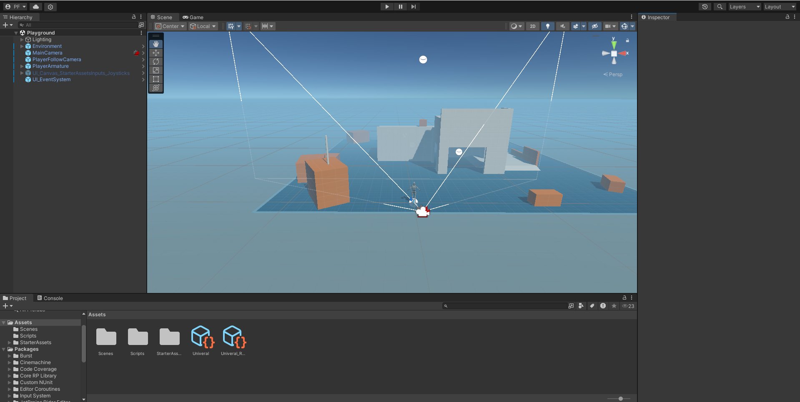
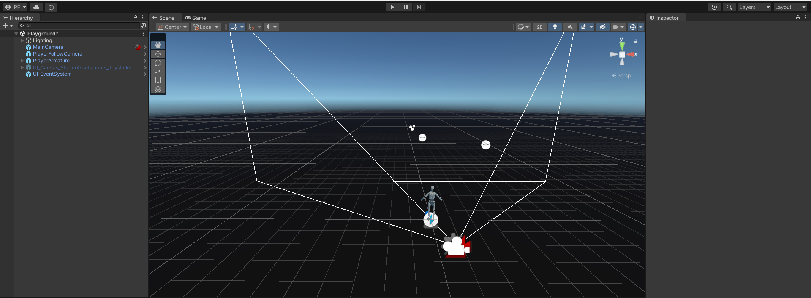
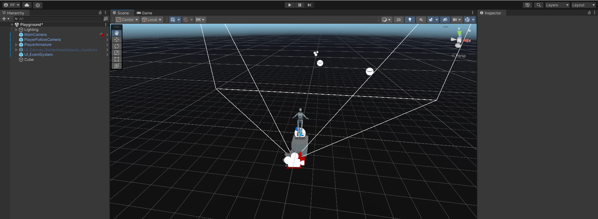
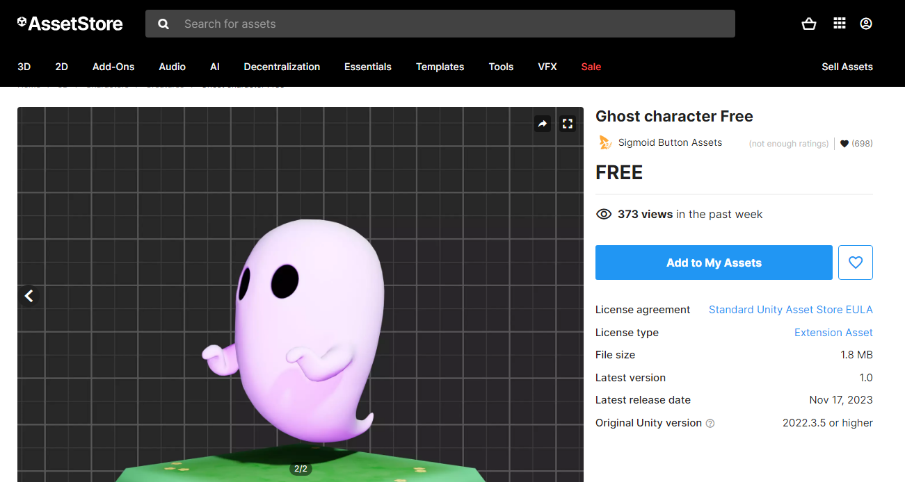
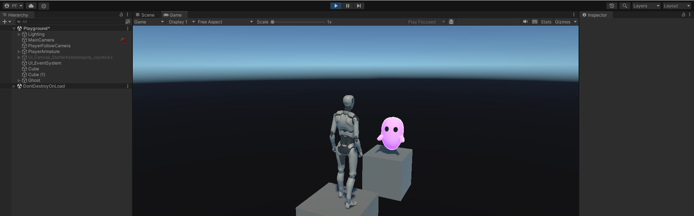
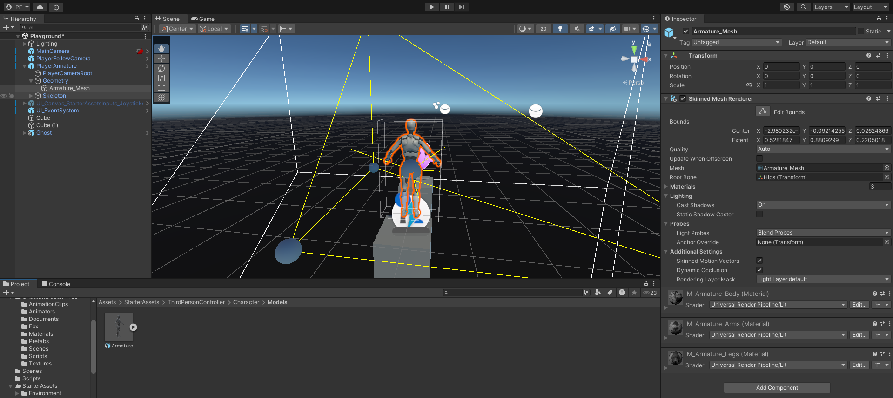
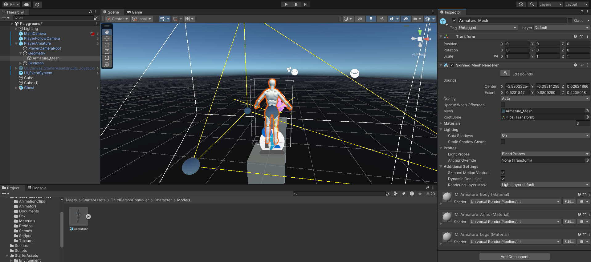
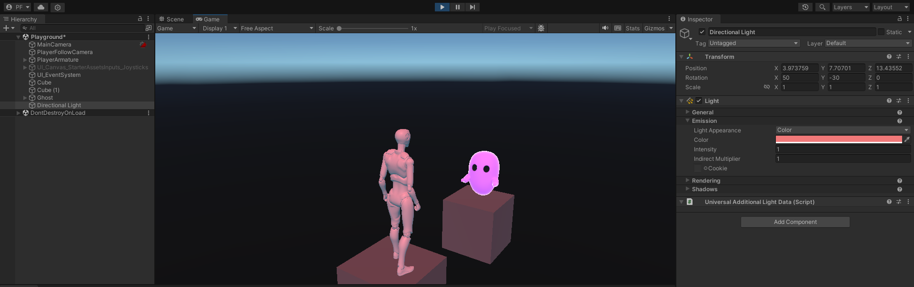
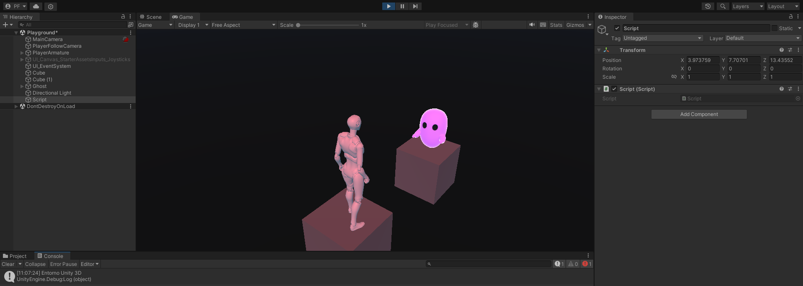

# 1.2 Entorno Unity 3D

## Familiarizarse con la interfaz de Unity

Crear un proyecto Unity 3D básico que cumpla los siguientes requisitos:

1. Cargar la escena de prueba de los starter assets Third Person 
2. Conservar de la escena el personaje y elimina el entorno.
3. Incluye GameObjects del menú
4. Incluye GameObjects de la Asset Store
5. Convierte uno de los GameObjects incluido en el personaje
6. Agregar una fuente de iluminación y configurarla con luz de algún color distinto del blanco
7. Generar un script que muestre en consola un mensaje

### Cargar la escena de prueba

*Figura 1: Escena con los starter assets*

### Conservar de la escena el personaje y elimina el entorno

*Figura 2: Personaje sin entotno*

### Incluye GameObjects del menú

*Figura 3: Personaje encima de un Gameobject*

### Incluye GameObjects de la Asset Store

En la Asset Store me puse a buscar algún gameObject gratuito, donde encontré un fantasma que me gustó (Figura 4). Tras encontrar este gameObject lo importe al proyecto directamente (Figura 5).

*Figura 4: Asset Store de Unity*

*Figura 5: Gameobject de la Asset Store enfrente del Personaje*

### Convierte uno de los GameObjects incluido en el personaje

El gameObject que decidí convertir fue el "Armature_Mesh" del personaje y lo que hice fue resetear los materiales del personaje. Los materiales los cambié del color por defecto que venían con el personaje de la asset store a los colores por defecto que tiene unity internatmente.

*Figura 6: Materiales del personaje por defecto*

*Figura 7: Reseteo de los Materiales*

### Agregar una fuente de iluminación y configurarla con luz de algún color distinto del blanco

*Figura 8: Iluminación Roja en el Juego*

### Generar un script que muestre en consola un mensaje

*Figura 9: Ejecución del Script*
